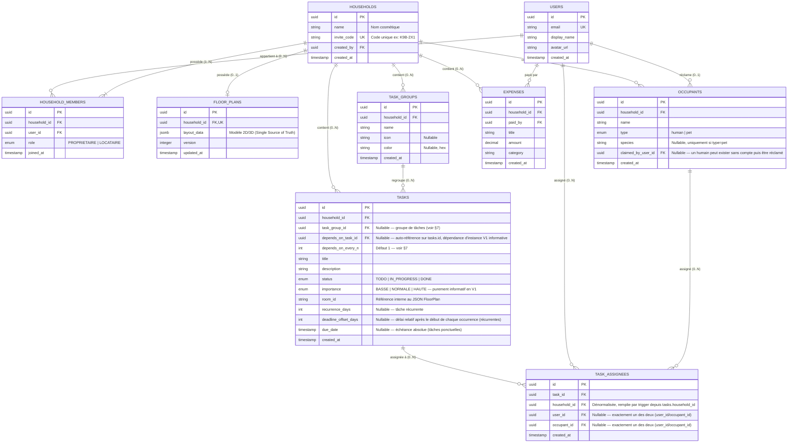

# 🗄️ Modèle de Données — Chez Nous

> **Projet :** Chez Nous  
> **Fichier :** `DATAMODEL.md`  
> **Type :** Spécification Base de Données Relational, RLS & Schémas JSON  
> **Portée :** Utilisateurs, Foyers, Rôles (Propriétaire/Locataire), Tâches, Dépenses et Éditeur Spatial  
> **Dernière mise à jour :** 1er août 2026  

---

## 📐 1. Diagramme Entité-Relation (ERD)



---

## 🗂️ 2. Dictionnaire des Tables Relationnelles

### 👤 Table `users`
Stocke les comptes utilisateurs de la plateforme.

| Colonne | Type | Contraintes | Description |
| :--- | :--- | :--- | :--- |
| `id` | `UUID` | `PRIMARY KEY`, Default `gen_random_uuid()` | Identifiant unique de l'utilisateur. |
| `email` | `VARCHAR(255)` | `UNIQUE`, `NOT NULL` | Adresse email de connexion. |
| `display_name` | `VARCHAR(100)` | `NOT NULL` | Nom d'affichage (ex: "Alex", "Admin"). |
| `avatar_url` | `TEXT` | `NULLABLE` | Lien vers l'image de profil. |
| `created_at` | `TIMESTAMPTZ` | `NOT NULL`, Default `NOW()` | Date d'inscription. |

> **Pas de colonne `password_hash` ici** *(corrigé — incohérence trouvée avec §6, qui l'affirmait déjà)* : Supabase Auth gère l'authentification dans `auth.users`, jamais dupliquée dans `public.users`.

---

### 🏠 Table `households`
Représente un foyer/logement.

| Colonne | Type | Contraintes | Description |
| :--- | :--- | :--- | :--- |
| `id` | `UUID` | `PRIMARY KEY`, Default `gen_random_uuid()` | Identifiant unique et immuable du foyer. |
| `name` | `VARCHAR(100)` | `NOT NULL` | Nom cosmétique (non unique). Ex: "Appartement Paris 11". |
| `invite_code` | `VARCHAR(10)` | `UNIQUE`, `NOT NULL` | Code court unique généré à la création (ex: `K9B-2X1`). |
| `created_by` | `UUID` | `FOREIGN KEY (users.id)` | Utilisateur créateur initial du foyer. |
| `created_at` | `TIMESTAMPTZ` | `NOT NULL`, Default `NOW()` | Date de création du foyer. |

---

### 👥 Table `household_members` (Table de Jonction)
Gère le rattachement N-N entre les utilisateurs et les foyers, ainsi que les niveaux de droits.

| Colonne | Type | Contraintes | Description |
| :--- | :--- | :--- | :--- |
| `id` | `UUID` | `PRIMARY KEY`, Default `gen_random_uuid()` | Clé primaire de la relation. |
| `household_id` | `UUID` | `FOREIGN KEY (households.id) ON DELETE CASCADE` | Foyer concerné. |
| `user_id` | `UUID` | `FOREIGN KEY (users.id) ON DELETE CASCADE` | Utilisateur membre. |
| `role` | `VARCHAR(20)` | `NOT NULL`, Default `'LOCATAIRE'` | Rôle : **`PROPRIETAIRE`** (Créateur/Admin plan) ou **`LOCATAIRE`** (Membre). |
| `joined_at` | `TIMESTAMPTZ` | `NOT NULL`, Default `NOW()` | Date d'arrivée dans le foyer. |

> **Contrainte d'unicité :** `UNIQUE(household_id, user_id)` (un utilisateur ne peut pas figurer 2 fois dans le même foyer).

---

### 📐 Table `floor_plans`
Stocke la donnée spatiale du logement pour le moteur 2D/3D.

| Colonne | Type | Contraintes | Description |
| :--- | :--- | :--- | :--- |
| `id` | `UUID` | `PRIMARY KEY`, Default `gen_random_uuid()` | Identifiant du plan. |
| `household_id` | `UUID` | `UNIQUE`, `FOREIGN KEY (households.id) ON DELETE CASCADE` | 1 seul plan actif par foyer. |
| `layout_data` | `JSONB` | `NOT NULL` | Structure JSON complète du plan (voir section 5). |
| `version` | `INTEGER` | `NOT NULL`, Default `1` | Incrément de version pour sync optimistic lock. |
| `updated_at` | `TIMESTAMPTZ` | `NOT NULL`, Default `NOW()` | Horodatage de dernière modification. |

---

### 📋 Table `tasks`
Gère les tâches ménagères et corvées du foyer. **Schéma V1 (chantier 🅲) exécuté le 03/08/2026** — voir §7 pour le détail produit (groupes, assignation, dépendances).

| Colonne | Type | Contraintes | Description |
| :--- | :--- | :--- | :--- |
| `id` | `UUID` | `PRIMARY KEY`, Default `gen_random_uuid()` | Identifiant de la tâche. |
| `household_id` | `UUID` | `FOREIGN KEY (households.id) ON DELETE CASCADE` | Foyer rattaché. |
| `task_group_id` | `UUID` | `NULLABLE`, `FOREIGN KEY (task_groups.id) ON DELETE SET NULL` | Groupe de tâches (§7) — supprimer le groupe dégroupe la tâche, ne la supprime pas. |
| `title` | `TEXT` | `NOT NULL` | Intitulé de la tâche. |
| `description` | `TEXT` | `NULLABLE` | Description libre. |
| `status` | `VARCHAR(20)` | `NOT NULL`, Default `'TODO'` | État : `TODO`, `IN_PROGRESS`, `DONE`. N'importe quel assigné qui coche la tâche la termine pour tout le monde (décidé 03/08/2026) — pas de statut par assigné. |
| `importance` | enum `task_importance` | `NOT NULL`, Default `'NORMALE'` | `BASSE` \| `NORMALE` \| `HAUTE` — purement informatif/visuel en V1, aucune logique de calcul liée. |
| `room_id` | `VARCHAR(50)` | `NULLABLE` | ID de la pièce associée (référence `room.id` du JSON plan). |
| `recurrence_days` | `INTEGER` | `NULLABLE` | Récurrence en jours ("tous les N jours"). `NULL` = tâche ponctuelle. |
| `due_date` | `TIMESTAMPTZ` | `NULLABLE` | Échéance absolue — pour une tâche **ponctuelle** (`recurrence_days` NULL). |
| `deadline_offset_days` | `INTEGER` | `NULLABLE`, `CHECK >= 0` | Délai relatif après le début de CHAQUE occurrence — pour une tâche **récurrente**. Pas de contrainte dure empêchant de remplir `due_date` ET ce champ en même temps ; la règle "l'un ou l'autre" reste appliquée côté formulaire frontend pour l'instant. |
| `depends_on_task_id` | `UUID` | `NULLABLE`, `FOREIGN KEY (tasks.id) ON DELETE SET NULL`, `CHECK depends_on_task_id IS DISTINCT FROM id` | Dépendance d'**instance** V1 (auto-référence) — **purement informative**, jamais bloquante (une dépendance non remplie affiche un avertissement, la tâche reste cochable). V2 : dépendance de *groupe*, hors périmètre ici. |
| `depends_on_every_n` | `INTEGER` | `NOT NULL`, Default `1`, `CHECK >= 1` | Mécanisme de couplage de récurrence (§7) : la tâche dépendante génère son occurrence toutes les N occurrences de sa dépendance, ancrées le même jour. |
| `created_at` | `TIMESTAMPTZ` | `NOT NULL`, Default `NOW()` | Date de création. |

> **Retiré (03/08/2026)** : `assigned_to`/`assigned_to_occupant_id` (colonnes uniques) — remplacées par la table de jonction `task_assignees` ci-dessous, qui permet une assignation multi-personnes/occupants.

---

### 🗂️ Table `task_groups`
Regroupe plusieurs instances de tâches (une par pièce) sous un même intitulé — remplace l'ancienne piste `task_rooms` (décision produit du 03/08/2026, voir §7). Une tâche d'un groupe reste une entité autonome : son propre `room_id`, son propre `status`.

| Colonne | Type | Contraintes | Description |
| :--- | :--- | :--- | :--- |
| `id` | `UUID` | `PRIMARY KEY`, Default `gen_random_uuid()` | Identifiant du groupe. |
| `household_id` | `UUID` | `FOREIGN KEY (households.id) ON DELETE CASCADE` | Foyer rattaché. |
| `name` | `TEXT` | `NOT NULL` | Nom du groupe (ex. "Laver les vitres"). Pas d'unicité forcée : deux groupes de même nom sont autorisés. |
| `icon` | `TEXT` | `NULLABLE` | Icône par défaut suggérée aux instances. |
| `color` | `TEXT` | `NULLABLE` | Couleur par défaut (hex) suggérée aux instances. |
| `created_at` | `TIMESTAMPTZ` | `NOT NULL`, Default `NOW()` | Date de création. |

---

### 👥 Table `task_assignees`
Assignation multi-personnes d'une tâche — une ligne par personne assignée, à un compte utilisateur **ou** à un occupant non-utilisateur (jamais les deux, jamais aucun des deux).

| Colonne | Type | Contraintes | Description |
| :--- | :--- | :--- | :--- |
| `id` | `UUID` | `PRIMARY KEY`, Default `gen_random_uuid()` | Identifiant de la ligne d'assignation. |
| `task_id` | `UUID` | `FOREIGN KEY (tasks.id) ON DELETE CASCADE` | Tâche concernée. |
| `household_id` | `UUID` | `FOREIGN KEY (households.id) ON DELETE CASCADE` | Dénormalisée (cohérent avec `tasks`/`expenses`) — **remplie automatiquement par trigger** depuis `tasks.household_id`, jamais depuis la valeur envoyée par le client. |
| `user_id` | `UUID` | `NULLABLE`, `FOREIGN KEY (users.id) ON DELETE CASCADE` | Renseigné si l'assigné est un compte utilisateur. |
| `occupant_id` | `UUID` | `NULLABLE`, `FOREIGN KEY (occupants.id) ON DELETE CASCADE` | Renseigné si l'assigné est un occupant non-utilisateur (ex. "le chat"). |
| `created_at` | `TIMESTAMPTZ` | `NOT NULL`, Default `NOW()` | Date d'assignation. |

> **Contraintes** : `CHECK (num_nonnulls(user_id, occupant_id) = 1)` (exactement un des deux) ; index uniques partiels sur `(task_id, user_id)` et `(task_id, occupant_id)` pour empêcher une double assignation de la même personne/du même occupant sur une même tâche.

---

### 💳 Table `expenses`
Gestion du budget partagé du foyer.

| Colonne | Type | Contraintes | Description |
| :--- | :--- | :--- | :--- |
| `id` | `UUID` | `PRIMARY KEY`, Default `gen_random_uuid()` | Identifiant de la dépense. |
| `household_id` | `UUID` | `FOREIGN KEY (households.id) ON DELETE CASCADE` | Foyer rattaché. |
| `paid_by` | `UUID` | `FOREIGN KEY (users.id)` | Payeur de la dépense. |
| `title` | `VARCHAR(255)` | `NOT NULL` | Libellé (ex: "Courses Carrefour"). |
| `amount` | `NUMERIC(10,2)`| `NOT NULL` | Montant total TTC. |
| `category` | `VARCHAR(50)` | `NOT NULL`, Default `'GENERAL'` | Catégorie (Alimentation, Énergie, Loyer, etc.). |
| `created_at` | `TIMESTAMPTZ` | `NOT NULL`, Default `NOW()` | Date de saisie. |

---

## 🔐 3. Matrice de Droits & Sécurité (RLS - Row Level Security)

Toutes les requêtes en base de données sont soumises à la vérification de l'appartenance de l'utilisateur au `household_id` via la table `household_members`.

| Action / Ressource | `PROPRIETAIRE` | `LOCATAIRE` |
| :--- | :---: | :---: |
| **Consulter le plan 2D / 3D** | ✅ | ✅ |
| **Modifier le plan (Murs, pièces, meubles)** | ✅ | ❌ *(Lecture seule)* |
| **Créer / Cocher des Tâches** | ✅ | ✅ |
| **Ajouter / Consulter des Dépenses** | ✅ | ✅ |
| **Rédiger des notes spatiales** | ✅ | ✅ |
| **Générer / Partager le code d'invitation** | ✅ | ✅ |
| **Transférer la propriété du foyer** | ✅ | ❌ |
| **Expulser un membre** | ✅ | ❌ |
| **Supprimer le foyer** | ✅ | ❌ |

---

## 🔄 4. Logique de Départ d'un Foyer & Transfert de Propriété

Lorsqu'un utilisateur déclenche l'action "Quitter le foyer", l'application exécute l'algorithme suivant :

```text
[Utilisateur clique sur "Quitter le foyer"]
                   │
                   ▼
       { Est-il PROPRIETAIRE ? }
          │               │
        Non              Oui
          │               │
          ▼               ▼
 [Retrait immédiat]  { Nombre de membres dans le foyer ? }
                          │                          │
                        N = 1                      N > 1
                          │                          │
                          ▼                          ▼
               [Suppression définitive]   [Bloqué : Pop-up Obligatoire]
               - Foyer                    "Veuillez choisir le nouveau
               - Plan 2D/3D             Propriétaire parmi les Locataires"
               - Tâches & Dépenses                   │
                                                     ▼
                                          [Sélection du successeur]
                                          1. Successeur -> PROPRIETAIRE
                                          2. Ancien Proprio -> Retiré
```

---

## 🎨 5. Structure JSON `floor_plans.layout_data` (Single Source of Truth)

Ce document JSON stocke l'intégralité du plan 2D/3D d'un foyer — un seul blob par foyer (`floor_plans.household_id` est `UNIQUE`), lu/écrit par `floorPlanService.js` avec verrou optimiste sur `version` (voir §2 du dictionnaire des tables). Une colonne `jsonb` ne contraint rien côté Postgres : cette structure est une **convention applicative**, validée côté frontend (`layout-editor/utils/validateLayout.js`, Zod) uniquement au moment d'un import de fichier.

```json
{
  "floors": [
    { "id": "uuid", "name": "Rez-de-chaussée", "shortLabel": "RDC", "level": 0,
      "avatarStart": { "x": 1, "y": 1 }, "gridWidth": 10, "gridHeight": 8 }
  ],
  "rooms": [
    { "id": "uuid", "floorId": "uuid", "name": "Salon", "type": "salon",
      "icon": "🛋️", "color": "#f3e6d0", "x": 0, "y": 0, "width": 3, "height": 3 }
  ],
  "doors": [
    { "id": "uuid", "floorId": "uuid", "orientation": "v", "x": 3, "y": 1 }
  ],
  "furniture": [],
  "spatialNotes": []
}
```

- **`floors`** : un enregistrement par étage. `avatarStart`/`gridWidth`/`gridHeight` sont **recalculés à chaque sauvegarde** à partir des pièces tracées (`saveFloorLayout`), jamais figés indépendamment.
- **`rooms`** : rectangles pleins `{x, y, width, height}` — **source de vérité éditable**. Toutes les cases d'une pièce sont du sol ; il n'existe pas de forme non rectangulaire (limite assumée, voir §3.2 de `PROJECT.md`).
- **`doors`** (nom de champ conservé, voir note terminologique ci-dessous) — ⚠️ **modèle mur-arête (introduit 01/08/2026, remplace le modèle précédent)** : chaque entrée identifie une **arête** (bordure entre deux cases), pas une case de grille. `orientation` (`'h'` = bordure horizontale, `'v'` = bordure verticale) + `{x, y}` forment une clé canonique unique (`orientation:x,y`) désignant toujours le même segment physique, qu'on le découvre depuis l'une ou l'autre pièce adjacente. Une entrée ne peut exister que sur la frontière entre deux pièces **qui se touchent réellement** (aucun écart) — voir ci-dessous. `furniture`/`spatialNotes` : présents dès la conception, vides pour l'instant, aucun code ne les lit/écrit encore.

⚠️ **Note terminologique (01/08/2026, demande explicite de Paul)** : le champ reste `doors` dans le blob persisté (aucune migration nécessaire, changement purement conceptuel), mais côté interaction/rendu, il ne s'agit plus de "portes" mais d'**ouvertures** — un pan de mur **retiré**, pas un objet de porte ajouté. Un mur plein reste le comportement par défaut entre deux pièces qui se touchent ; rien n'oblige une frontière à avoir une ouverture.

📝 **Note anticipée, non implémentée (03/08/2026)** — vision produit long terme, `PRODUCTVISION.md` §9 : Paul envisage une future "Vue Sécurité" (statut ouvert/fermé par ouverture, éventuellement connecté à des capteurs IoT) et un lien entre tâches et électroménager connecté. **Aucun changement de schéma n'est fait ici** — juste un repère pour plus tard : le modèle actuel de `doors` (une ouverture = un mur retiré, binaire et permanent) ne porte aujourd'hui aucune notion d'état "ouvert/fermé" qui varierait dans le temps, et ne distingue pas un simple passage libre d'une porte/fenêtre réellement installée. Le jour où ce chantier sera lancé, il faudra vraisemblablement un champ `type` (`opening`/`door`/`window`) plutôt qu'un simple `isOpen` ajouté tel quel — les **fenêtres** en particulier n'existent dans aucune partie de ce schéma aujourd'hui, à concevoir de zéro. Voir `PRODUCTVISION.md` §9.1 pour le raisonnement complet. De la même façon, un futur lien tâches ↔ électroménager connecté (§9.2) s'appuierait probablement sur `furniture` (vide, non lu/écrit aujourd'hui) plutôt que sur une nouvelle table — à confirmer le moment venu.

### Modèle mur-arête (calcul des murs, pas de stockage direct)

Les murs eux-mêmes **ne sont jamais stockés** — ni dans ce blob, ni ailleurs. Ils sont dérivés à la volée depuis `rooms` + `doors` par `computeRoomEdges()` (`layout-editor/utils/layoutGeneration.js`), à chaque rendu :

| Bordure entre... | Résultat |
| :--- | :--- |
| une pièce et le vide | `wall-ext` (mur extérieur) |
| deux pièces **différentes** qui se touchent | `wall-int` (cloison) |
| deux pièces différentes qui se touchent, **et** l'arête figure dans `doors` | `opening` — **aucun trait dessiné** (`WallEdges.jsx`), mur réellement retiré |
| deux cases de la **même** pièce | rien (invisible, intérieur de la pièce) |

Remplace l'ancien modèle où les murs étaient des **dalles pleines** générées autour de l'empreinte des pièces (1 case de grille par mur) : ce modèle avait deux défauts structurels — un mur consommait un mètre entier de grille, et deux pièces tracées directement collées (sans espace) n'avaient ni mur ni ouverture entre elles (case indisponible pour ça), donc fusionnaient visuellement. Le modèle mur-arête élimine les deux : le mur est un simple trait sur la bordure (aucune case consommée), et il existe **automatiquement** dès que deux pièces se touchent, sans cas particulier.

**Conséquence sur le placement des ouvertures (inverse de l'ancien modèle)** : une ouverture ne peut être créée qu'entre deux pièces **parfaitement adjacentes** (gap = 0) — avant, il fallait au contraire un écart d'exactement 1 case pour l'auto-détection (retirée). Deux pièces avec un espace vide entre elles affichent chacune leur propre mur extérieur indépendant face à ce vide, sans erreur ni fusion.

⚠️ **Compatibilité** : un plan enregistré avant l'ajout de `orientation` a des entrées au format `{id, floorId, x, y}` (sans `orientation`) — non reconnues comme valides par le code actuel (silencieusement ignorées, pas de crash). Un plan de test existant doit être réinitialisé (bouton "🗑️ Réinitialiser cet étage", dans l'éditeur) avant de revalider ce chantier.


---

## 🧩 6. Extensions au-delà de ce schéma (conservées côté implémentation)

Ajoutées lors de la mise en place technique du schéma ci-dessus — présentes
dans `backend/supabase/migrations/`, absentes des sections précédentes.
Documentées ici plutôt que supprimées silencieusement ; à valider/rejeter
explicitement plutôt qu'à laisser diverger sans trace.

* **Table `occupants`** (humains ou animaux, distincts des comptes `users`) :
  un occupant humain peut exister sans compte (`claimed_by_user_id NULL`),
  puis être "réclamé" par un compte. Un animal ne peut jamais être réclamé.
  Permet d'assigner une tâche à un animal, ou à un humain du foyer qui n'a
  pas (encore) de compte.
* ~~**`tasks.assigned_to_occupant_id`**~~ **Obsolète depuis le 03/08/2026** :
  cette colonne (et `tasks.assigned_to`) a été remplacée par la table
  `task_assignees` (§2, §7) — une tâche peut désormais être assignée à
  **plusieurs** comptes utilisateurs et/ou occupants non-utilisateurs
  (ex. "Nourrir le chat"), pas un seul à la fois.
* **`tasks.description`** et **`tasks.recurrence_days`** : texte libre et
  récurrence en jours (tâches ménagères répétitives) — désormais dans
  le schéma canonique ci-dessus (§2), plus une extension.
* **`users`** : pas de colonne `password_hash` — Supabase Auth gère le mot
  de passe dans `auth.users`, jamais dupliqué dans `public.users` (le
  dupliquer serait un risque de sécurité sans bénéfice). `display_name` et
  `avatar_url` conservés du schéma d'origine.

---

## 🧹 7. Modèle des Tâches V1 (chantier 🅲)

**Migration `backend/supabase/migrations/04_tasks_v1_schema.sql` — exécutée avec succès sur le projet Supabase réel le 03/08/2026** (confirmé par Paul, capture d'écran du SQL Editor : script complet exécuté sans erreur). Schéma détaillé en §2 (tables `tasks`, `task_groups`, `task_assignees`). Vision produit complète et rationale : `PRODUCTVISION.md` §4 — cette section ne fait que documenter le **schéma retenu**, pas ré-expliquer le raisonnement produit.

- **Groupe de tâches** (`task_groups`) : une même "sorte" de tâche répétée dans plusieurs pièces (ex. "Laver les vitres" Salon + Cuisine) = plusieurs lignes `tasks` **distinctes**, une par pièce, chacune avec son propre `status` — rattachées à un `task_group_id` commun, purement organisationnel. Remplace l'ancienne piste `task_rooms` (jamais implémentée). Supprimer un groupe ne supprime pas ses tâches (`ON DELETE SET NULL`).
- **Assignation multi-personnes** (`task_assignees`) : une tâche peut être assignée à plusieurs comptes utilisateurs et/ou occupants non-utilisateurs (table `occupants`, §6) simultanément. N'importe quel assigné qui coche la tâche la termine pour tout le monde — pas de statut individuel par assigné, `tasks.status` seul fait foi.
- **Dépendances (V1 limitée à l'instance)** : `tasks.depends_on_task_id` (auto-référence), **purement informative** — une dépendance non remplie affiche un avertissement, jamais un blocage (pas de gestion de cycle nécessaire en V1 pour cette raison). `depends_on_every_n` (défaut 1) porte le mécanisme de **couplage de récurrence** : la tâche dépendante n'a pas de `recurrence_days` indépendant à long terme, sa fréquence effective est dérivée de celle de sa dépendance (`recurrence_days` dépendante = `recurrence_days` dépendance × `depends_on_every_n`), les deux ancrées sur la même origine pour que leurs occurrences tombent le même jour. **Algorithme de calcul de la prochaine échéance pas encore écrit** — décision produit actée, implémentation à faire lors du câblage frontend/backend des occurrences.
- **Dépendance de groupe** (règle générique appliquée à chaque instance d'un groupe) : **V2, hors périmètre** — nécessiterait une table `task_group_dependencies` distincte, pas construite ici.
- **Importance** (`tasks.importance`) : `BASSE`/`NORMALE`/`HAUTE`, purement informatif/visuel en V1 (tri, badge) — aucune logique de calcul liée pour l'instant (pourra peser sur la dette de ménage plus tard, chantier 🅳, pas décidé).
- **Ponctuelle vs récurrente** : `due_date` (échéance absolue) pour une tâche ponctuelle, `deadline_offset_days` (délai relatif après le début de CHAQUE occurrence) pour une récurrente — pas de `CHECK` en base empêchant de remplir les deux, règle appliquée côté formulaire pour l'instant.
- **Prochaine étape** : câbler le frontend (`HouseholdTasksPage.jsx`, `RoomDetailView.jsx`) sur ce schéma — aucun des deux ne l'utilise encore, tous deux en placeholder (voir `PROJECT.md` §Phase 2/🅲 et `TODO.md` #10/#11).