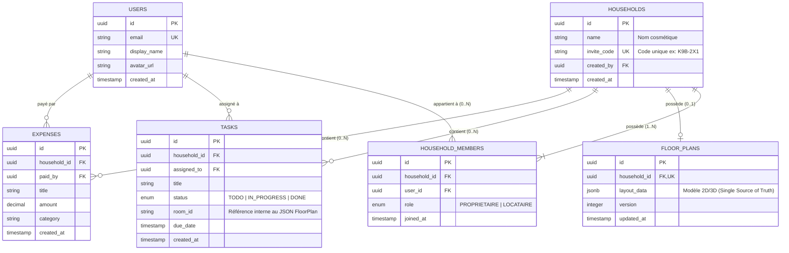

# 🗄️ Modèle de Données — Chez Nous

> **Projet :** Chez Nous  
> **Fichier :** `docs/DATA_MODEL.md`  
> **Type :** Spécification Base de Données Relational, RLS & Schémas JSON  
> **Portée :** Utilisateurs, Foyers, Rôles (Propriétaire/Locataire), Tâches, Dépenses et Éditeur Spatial  
> **Dernière mise à jour :** 1er août 2026  

---

## 📐 1. Diagramme Entité-Relation (ERD)



---

## 🗂️ 2. Dictionnaire des Tables Relationnelles

### 👤 Table `users`
Stocke les comptes utilisateurs de la plateforme.

| Colonne | Type | Contraintes | Description |
| :--- | :--- | :--- | :--- |
| `id` | `UUID` | `PRIMARY KEY`, Default `gen_random_uuid()` | Identifiant unique de l'utilisateur. |
| `email` | `VARCHAR(255)` | `UNIQUE`, `NOT NULL` | Adresse email de connexion. |
| `display_name` | `VARCHAR(100)` | `NOT NULL` | Nom d'affichage (ex: "Alex", "Admin"). |
| `avatar_url` | `TEXT` | `NULLABLE` | Lien vers l'image de profil. |
| `created_at` | `TIMESTAMPTZ` | `NOT NULL`, Default `NOW()` | Date d'inscription. |

> **Pas de colonne `password_hash` ici** *(corrigé — incohérence trouvée avec §6, qui l'affirmait déjà)* : Supabase Auth gère l'authentification dans `auth.users`, jamais dupliquée dans `public.users`.

---

### 🏠 Table `households`
Représente un foyer/logement.

| Colonne | Type | Contraintes | Description |
| :--- | :--- | :--- | :--- |
| `id` | `UUID` | `PRIMARY KEY`, Default `gen_random_uuid()` | Identifiant unique et immuable du foyer. |
| `name` | `VARCHAR(100)` | `NOT NULL` | Nom cosmétique (non unique). Ex: "Appartement Paris 11". |
| `invite_code` | `VARCHAR(10)` | `UNIQUE`, `NOT NULL` | Code court unique généré à la création (ex: `K9B-2X1`). |
| `created_by` | `UUID` | `FOREIGN KEY (users.id)` | Utilisateur créateur initial du foyer. |
| `created_at` | `TIMESTAMPTZ` | `NOT NULL`, Default `NOW()` | Date de création du foyer. |

---

### 👥 Table `household_members` (Table de Jonction)
Gère le rattachement N-N entre les utilisateurs et les foyers, ainsi que les niveaux de droits.

| Colonne | Type | Contraintes | Description |
| :--- | :--- | :--- | :--- |
| `id` | `UUID` | `PRIMARY KEY`, Default `gen_random_uuid()` | Clé primaire de la relation. |
| `household_id` | `UUID` | `FOREIGN KEY (households.id) ON DELETE CASCADE` | Foyer concerné. |
| `user_id` | `UUID` | `FOREIGN KEY (users.id) ON DELETE CASCADE` | Utilisateur membre. |
| `role` | `VARCHAR(20)` | `NOT NULL`, Default `'LOCATAIRE'` | Rôle : **`PROPRIETAIRE`** (Créateur/Admin plan) ou **`LOCATAIRE`** (Membre). |
| `joined_at` | `TIMESTAMPTZ` | `NOT NULL`, Default `NOW()` | Date d'arrivée dans le foyer. |

> **Contrainte d'unicité :** `UNIQUE(household_id, user_id)` (un utilisateur ne peut pas figurer 2 fois dans le même foyer).

---

### 📐 Table `floor_plans`
Stocke la donnée spatiale du logement pour le moteur 2D/3D.

| Colonne | Type | Contraintes | Description |
| :--- | :--- | :--- | :--- |
| `id` | `UUID` | `PRIMARY KEY`, Default `gen_random_uuid()` | Identifiant du plan. |
| `household_id` | `UUID` | `UNIQUE`, `FOREIGN KEY (households.id) ON DELETE CASCADE` | 1 seul plan actif par foyer. |
| `layout_data` | `JSONB` | `NOT NULL` | Structure JSON complète du plan (voir section 5). |
| `version` | `INTEGER` | `NOT NULL`, Default `1` | Incrément de version pour sync optimistic lock. |
| `updated_at` | `TIMESTAMPTZ` | `NOT NULL`, Default `NOW()` | Horodatage de dernière modification. |

---

### 📋 Table `tasks`
Gère les tâches ménagères et corvées du foyer.

| Colonne | Type | Contraintes | Description |
| :--- | :--- | :--- | :--- |
| `id` | `UUID` | `PRIMARY KEY`, Default `gen_random_uuid()` | Identifiant de la tâche. |
| `household_id` | `UUID` | `FOREIGN KEY (households.id) ON DELETE CASCADE` | Foyer rattaché. |
| `assigned_to` | `UUID` | `NULLABLE`, `FOREIGN KEY (users.id)` | Membre responsable de la tâche. |
| `title` | `VARCHAR(255)` | `NOT NULL` | Intitulé de la tâche. |
| `status` | `VARCHAR(20)` | `NOT NULL`, Default `'TODO'` | État : `TODO`, `IN_PROGRESS`, `DONE`. |
| `room_id` | `VARCHAR(50)` | `NULLABLE` | ID de la pièce associée (référence `room.id` du JSON plan). |
| `due_date` | `TIMESTAMPTZ` | `NULLABLE` | Échéance. |
| `created_at` | `TIMESTAMPTZ` | `NOT NULL`, Default `NOW()` | Date de création. |

---

### 💳 Table `expenses`
Gestion du budget partagé du foyer.

| Colonne | Type | Contraintes | Description |
| :--- | :--- | :--- | :--- |
| `id` | `UUID` | `PRIMARY KEY`, Default `gen_random_uuid()` | Identifiant de la dépense. |
| `household_id` | `UUID` | `FOREIGN KEY (households.id) ON DELETE CASCADE` | Foyer rattaché. |
| `paid_by` | `UUID` | `FOREIGN KEY (users.id)` | Payeur de la dépense. |
| `title` | `VARCHAR(255)` | `NOT NULL` | Libellé (ex: "Courses Carrefour"). |
| `amount` | `NUMERIC(10,2)`| `NOT NULL` | Montant total TTC. |
| `category` | `VARCHAR(50)` | `NOT NULL`, Default `'GENERAL'` | Catégorie (Alimentation, Énergie, Loyer, etc.). |
| `created_at` | `TIMESTAMPTZ` | `NOT NULL`, Default `NOW()` | Date de saisie. |

---

## 🔐 3. Matrice de Droits & Sécurité (RLS - Row Level Security)

Toutes les requêtes en base de données sont soumises à la vérification de l'appartenance de l'utilisateur au `household_id` via la table `household_members`.

| Action / Ressource | `PROPRIETAIRE` | `LOCATAIRE` |
| :--- | :---: | :---: |
| **Consulter le plan 2D / 3D** | ✅ | ✅ |
| **Modifier le plan (Murs, pièces, meubles)** | ✅ | ❌ *(Lecture seule)* |
| **Créer / Cocher des Tâches** | ✅ | ✅ |
| **Ajouter / Consulter des Dépenses** | ✅ | ✅ |
| **Rédiger des notes spatiales** | ✅ | ✅ |
| **Générer / Partager le code d'invitation** | ✅ | ✅ |
| **Transférer la propriété du foyer** | ✅ | ❌ |
| **Expulser un membre** | ✅ | ❌ |
| **Supprimer le foyer** | ✅ | ❌ |

---

## 🔄 4. Logique de Départ d'un Foyer & Transfert de Propriété

Lorsqu'un utilisateur déclenche l'action "Quitter le foyer", l'application exécute l'algorithme suivant :

```text
[Utilisateur clique sur "Quitter le foyer"]
                   │
                   ▼
       { Est-il PROPRIETAIRE ? }
          │               │
        Non              Oui
          │               │
          ▼               ▼
 [Retrait immédiat]  { Nombre de membres dans le foyer ? }
                          │                          │
                        N = 1                      N > 1
                          │                          │
                          ▼                          ▼
               [Suppression définitive]   [Bloqué : Pop-up Obligatoire]
               - Foyer                    "Veuillez choisir le nouveau
               - Plan 2D/3D             Propriétaire parmi les Locataires"
               - Tâches & Dépenses                   │
                                                     ▼
                                          [Sélection du successeur]
                                          1. Successeur -> PROPRIETAIRE
                                          2. Ancien Proprio -> Retiré
```

---

## 🎨 5. Structure JSON `floor_plans.layout_data` (Single Source of Truth)

Ce document JSON stocke l'intégralité du plan 2D/3D d'un foyer — un seul blob par foyer (`floor_plans.household_id` est `UNIQUE`), lu/écrit par `floorPlanService.js` avec verrou optimiste sur `version` (voir §2 du dictionnaire des tables). Une colonne `jsonb` ne contraint rien côté Postgres : cette structure est une **convention applicative**, validée côté frontend (`layout-editor/utils/validateLayout.js`, Zod) uniquement au moment d'un import de fichier.

```json
{
  "floors": [
    { "id": "uuid", "name": "Rez-de-chaussée", "shortLabel": "RDC", "level": 0,
      "avatarStart": { "x": 1, "y": 1 }, "gridWidth": 10, "gridHeight": 8 }
  ],
  "rooms": [
    { "id": "uuid", "floorId": "uuid", "name": "Salon", "type": "salon",
      "icon": "🛋️", "color": "#f3e6d0", "x": 0, "y": 0, "width": 3, "height": 3 }
  ],
  "doors": [
    { "id": "uuid", "floorId": "uuid", "orientation": "v", "x": 3, "y": 1 }
  ],
  "furniture": [],
  "spatialNotes": []
}
```

- **`floors`** : un enregistrement par étage. `avatarStart`/`gridWidth`/`gridHeight` sont **recalculés à chaque sauvegarde** à partir des pièces tracées (`saveFloorLayout`), jamais figés indépendamment.
- **`rooms`** : rectangles pleins `{x, y, width, height}` — **source de vérité éditable**. Toutes les cases d'une pièce sont du sol ; il n'existe pas de forme non rectangulaire (limite assumée, voir §3.2 de `PROJET.md`).
- **`doors`** — ⚠️ **modèle mur-arête (introduit 01/08/2026, remplace le modèle précédent)** : une porte identifie une **arête** (bordure entre deux cases), pas une case de grille. `orientation` (`'h'` = bordure horizontale, `'v'` = bordure verticale) + `{x, y}` forment une clé canonique unique (`orientation:x,y`) désignant toujours le même segment physique, qu'on le découvre depuis l'une ou l'autre pièce adjacente. Une porte ne peut exister que sur la frontière entre deux pièces **qui se touchent réellement** (aucun écart) — voir ci-dessous. `furniture`/`spatialNotes` : présents dès la conception, vides pour l'instant, aucun code ne les lit/écrit encore.

### Modèle mur-arête (calcul des murs, pas de stockage direct)

Les murs eux-mêmes **ne sont jamais stockés** — ni dans ce blob, ni ailleurs. Ils sont dérivés à la volée depuis `rooms` + `doors` par `computeRoomEdges()` (`layout-editor/utils/layoutGeneration.js`), à chaque rendu :

| Bordure entre... | Résultat |
| :--- | :--- |
| une pièce et le vide | `wall-ext` (mur extérieur) |
| deux pièces **différentes** qui se touchent | `wall-int` (cloison) |
| deux pièces différentes qui se touchent, **et** l'arête figure dans `doors` | `door` |
| deux cases de la **même** pièce | rien (invisible, intérieur de la pièce) |

Remplace l'ancien modèle où les murs étaient des **dalles pleines** générées autour de l'empreinte des pièces (1 case de grille par mur) : ce modèle avait deux défauts structurels — un mur consommait un mètre entier de grille, et deux pièces tracées directement collées (sans espace) n'avaient ni mur ni porte entre elles (case indisponible pour ça), donc fusionnaient visuellement. Le modèle mur-arête élimine les deux : le mur est un simple trait sur la bordure (aucune case consommée), et il existe **automatiquement** dès que deux pièces se touchent, sans cas particulier.

**Conséquence sur le placement des portes (inverse de l'ancien modèle)** : une porte ne peut être percée qu'entre deux pièces **parfaitement adjacentes** (gap = 0) — avant, il fallait au contraire un écart d'exactement 1 case pour l'auto-détection. Deux pièces avec un espace vide entre elles affichent chacune leur propre mur extérieur indépendant face à ce vide, sans erreur ni fusion.

⚠️ **Compatibilité** : un plan enregistré avant ce changement a des portes au format `{id, floorId, x, y}` (sans `orientation`) — non reconnues comme portes valides par le nouveau code (silencieusement ignorées, pas de crash). Un plan de test existant doit être réinitialisé (bouton "🗑️ Réinitialiser le plan") avant de revalider ce chantier.

---

## 🧩 6. Extensions au-delà de ce schéma (conservées côté implémentation)

Ajoutées lors de la mise en place technique du schéma ci-dessus — présentes
dans `backend/supabase/migrations/`, absentes des sections précédentes.
Documentées ici plutôt que supprimées silencieusement ; à valider/rejeter
explicitement plutôt qu'à laisser diverger sans trace.

* **Table `occupants`** (humains ou animaux, distincts des comptes `users`) :
  un occupant humain peut exister sans compte (`claimed_by_user_id NULL`),
  puis être "réclamé" par un compte. Un animal ne peut jamais être réclamé.
  Permet d'assigner une tâche à un animal, ou à un humain du foyer qui n'a
  pas (encore) de compte.
* **`tasks.assigned_to_occupant_id`** : en plus de `tasks.assigned_to`
  (compte utilisateur), une tâche peut être assignée à un occupant non-
  utilisateur (ex. "Nourrir le chat").
* **`tasks.description`** et **`tasks.recurrence_days`** : texte libre et
  récurrence en jours (tâches ménagères répétitives).
* **`users`** : pas de colonne `password_hash` — Supabase Auth gère le mot
  de passe dans `auth.users`, jamais dupliqué dans `public.users` (le
  dupliquer serait un risque de sécurité sans bénéfice). `display_name` et
  `avatar_url` conservés du schéma d'origine.