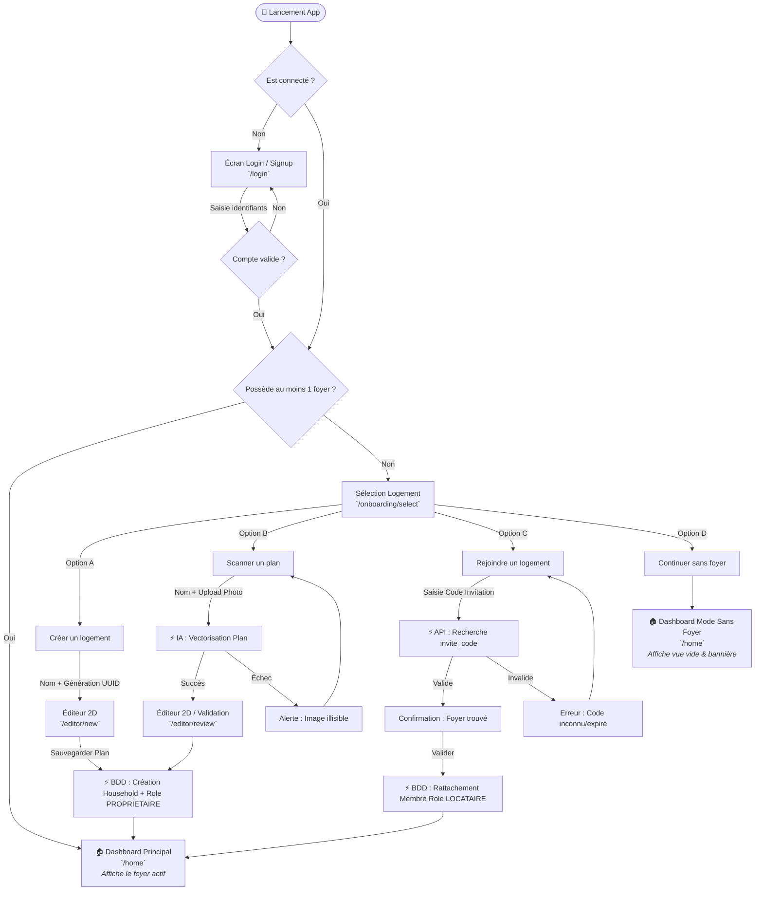

# 📄 User Flow — Onboarding & Rattachement Foyer

> **Projet :** Chez Nous 
> **Fichier :** `docs/user-flows/USER_FLOW_ONBOARDING.md`  
> **Composant :** Auth & Onboarding  
> **Dernière mise à jour :** Juillet 2026  

---

## 📐 1. Règles Métier & Contexte Métier

* **Foyer (`Household`) :**
  * Possède un identifiant unique technique non modifiable (`household_id` de type UUID).
  * Possède un nom d'affichage cosmétique choisi par l'utilisateur (non unique en BDD).
  * Possède un code d'invitation unique (`invite_code`).
* **Gestion des Rôles :**
  * **`PROPRIETAIRE` :** L'utilisateur qui crée le foyer. Seul habilité à modifier le plan, gérer les membres et transférer la propriété.
  * **`LOCATAIRE` :** L'utilisateur qui rejoint un foyer via un code d'invitation. Accès complet aux modules (tâches, dépenses, notes) mais plan en lecture seule.
* **Cardinalités :**
  * Un **Utilisateur** appartient à **0, 1 ou plusieurs Foyers** (`0..N`).
  * Un **Foyer** possède **au moins 1 occupant** (`1..N`).
* **Cas particulier "Mode sans foyer" :**
  * Un utilisateur peut ignorer la création/rattachement à l'inscription. L'application bascule alors dans un état par défaut ("Empty State").

---

## 📊 2. Diagramme de Flux (Mermaid)

---

## 📝 3. Description Étape par Étape

### Step 1 : Guard & Authentification (`/login`)
* Si l'utilisateur n'a pas de session active $\rightarrow$ Redirection vers `/login`.
* Après connexion réussie, vérification du nombre de foyers associés au compte dans `household_members`.

### Step 2 : Écran d'Onboarding (`/onboarding/select`)
Présente un accordéon à 3 options principales + 1 option secondaire d'abandon temporaire :

1. **Option A — Créer un logement :** Saisie du nom cosmétique $\rightarrow$ Ouverture de l'éditeur 2D $\rightarrow$ Validation $\rightarrow$ Création du `household_id` et attribution du rôle **`PROPRIETAIRE`**.
2. **Option B — Scanner un plan :** Saisie du nom + Importation d'image $\rightarrow$ Traitement IA $\rightarrow$ Éditeur 2D pré-rempli $\rightarrow$ Validation $\rightarrow$ Attribution du rôle **`PROPRIETAIRE`**.
3. **Option C — Rejoindre un logement :** Saisie du code à 6-8 caractères $\rightarrow$ Vérification API $\rightarrow$ Confirmation du nom du foyer $\rightarrow$ Attribution du rôle **`LOCATAIRE`**.
4. **Option D — Continuer sans foyer :** Action secondaire pour passer la configuration $\rightarrow$ Accès immédiat à l'application en état restreint.

### Step 3 : Tableau de bord (`/home`)
* **Si `households.length > 0` :** Charge le plan 3D, les tâches et membres du foyer actif. Si l'utilisateur est `LOCATAIRE`, les outils d'édition du plan sont masqués/désactivés.
* **Si `households.length == 0` :** Affiche la vue "Foyer vide" avec incitation à créer ou rejoindre un logement.

---

## ⚠️ 4. Gestion des Cas Limites (Edge Cases)

| Cas limite | Risque | Résolution UX / Technique |
| :--- | :--- | :--- |
| **Le Propriétaire veut quitter le foyer ($N > 1$)** | Le foyer se retrouve sans gestionnaire du plan 2D/3D. | Action bloquée. Une modale impose le transfert du rôle `PROPRIETAIRE` à l'un des `LOCATAIRES` avant de valider le départ. |
| **Le Propriétaire quitte le foyer ($N = 1$)** | Foyer orphelin sans aucun occupant ($N=0$). | Suppression définitive et automatique du `Household`, de son `FloorPlan`, des `Tasks` et `Expenses` en BDD. |
| **Code d'invitation erroné** | Blocage utilisateur. | Message d'erreur explicite ("Code introuvable ou expiré") avec possibilité de réessayer sans recharger la page. |
| **Changement de Foyer Actif** | Incohérence des données affichées à l'écran. | Utilisation d'un `HouseholdContext` global côté Frontend. Tout changement recharge l'état complet lié au nouvel `household_id`. |